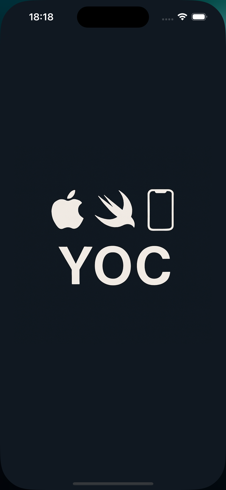
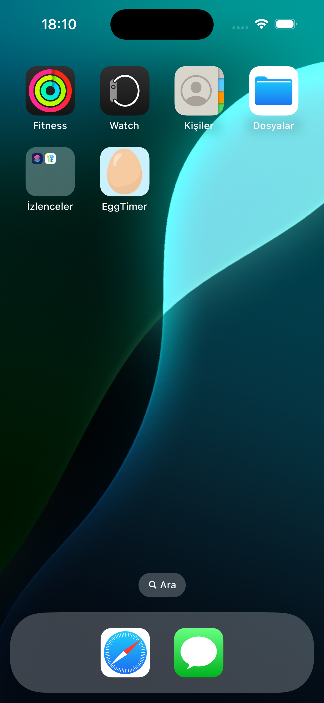
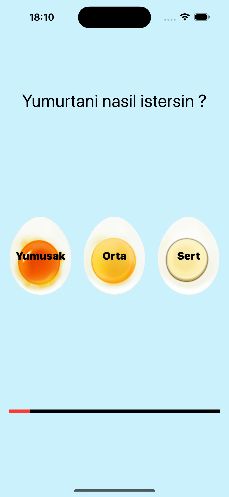
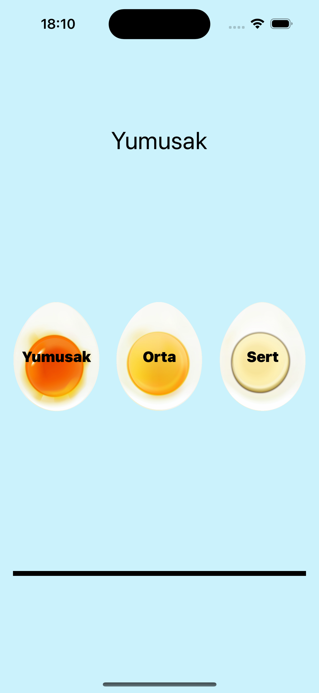

# 🥚 EggTimer – iOS App
EggTimer is a minimal and intuitive iOS app that helps you boil the perfect egg — every time! Whether you like it Soft, Medium, or Hard, just tap and let the timer do the rest.

## 📱 How It Works
Open the app.

Choose your preferred egg consistency:
Yumuşak (Soft) – Orta (Medium) – Sert (Hard)

The timer starts automatically based on your selection.

Get notified when your egg is ready!

## ✨ Features
Beautiful and simple UI

3 cooking options: Soft, Medium, Hard

Visual progress bar

SwiftUI-based native iOS experience

Fast and lightweight performance

## 🧪 Preview

###  🟦 Splash Screen

###  🥚 App Icon

###  📲 App Screens
Selection Screen	Timer Running	App 
	

## 🚀 Getting Started

To run the project locally:

1. Clone the repository:
   ```bash
   git clone https://github.com/YOUR_USERNAME/Egg_Timer.git


👨‍💻 Author
Yavuz Orhan Candemir
iOS Developer
